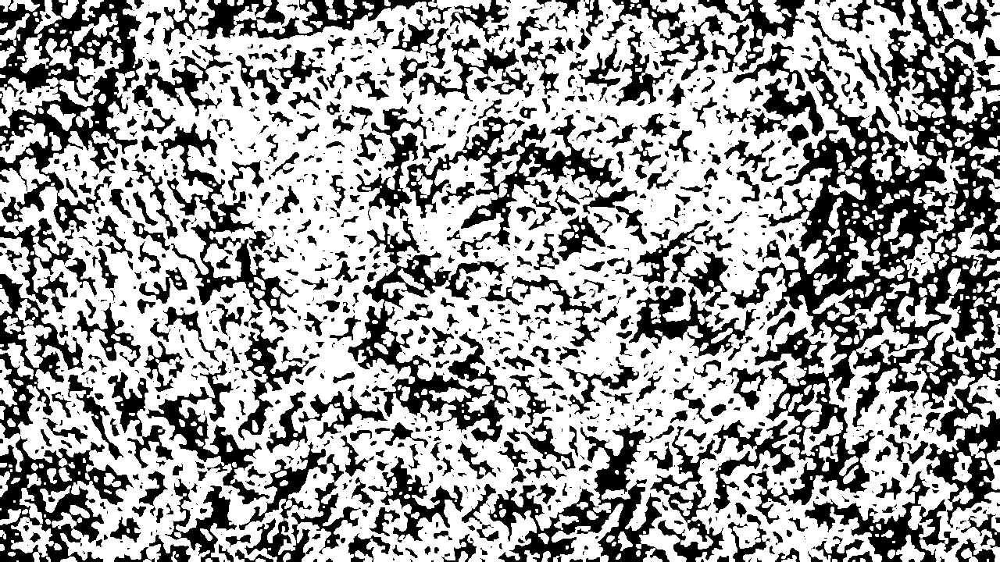
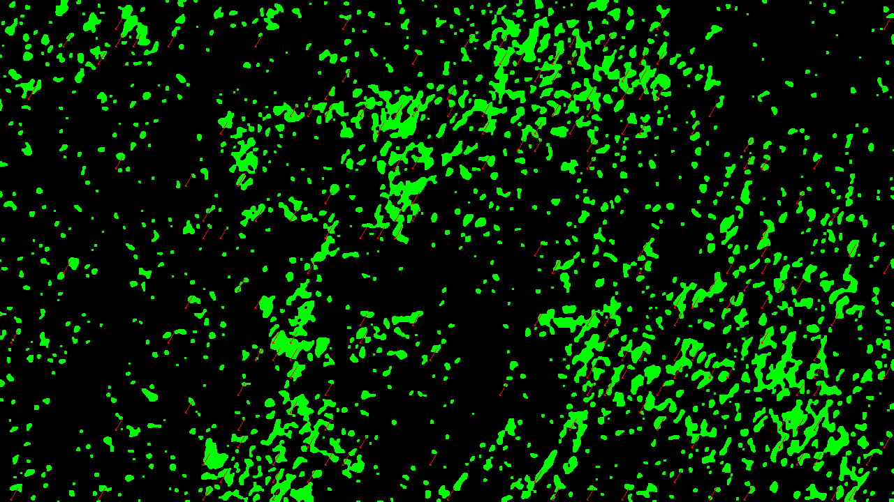

# Brushstroke Animation: Usage Guide

## Overview

This tool animates brushstrokes in paintings and artwork, creating subtle flowing movements that bring static images to life. By detecting brushstroke patterns with Gabor filters, the algorithm generates animations that respect the original composition while adding dynamic movement.

## Installation

1. Clone the repository:
```bash
git clone https://github.com/yourusername/brushstroke-animation.git
cd brushstroke-animation
```

2. Install required dependencies:
```bash
pip install numpy opencv-python imageio scikit-image
```

## Directory Structure

Create the following directory structure:
```
brushstroke-animation/
├── src/           # Contains the script
├── input/         # Place your images here
├── output/        # Generated animations will be saved here
└── debug/         # Debug visualizations (optional)
```

## Usage

1. Place your images in the `input/` directory (supports JPG, PNG)
2. Run the script:
```bash
python src/brushstroke_animation.py
```
3. Find the animated GIFs in the `output/` directory

## Gallery of Results

### Bringing Paintings to Life

This project explores the animation of brushstrokes in static paintings, revealing the inherent movement and energy captured within the artist's technique. By analyzing directional patterns in the artwork, our algorithm creates subtle, flowing animations that respect the original composition while adding a new dimension of visual experience.

Each painting responds differently to the animation process, with the resulting movement directly reflecting the artist's brushwork patterns and techniques. This creates a unique visual dialogue between traditional art forms and computational interpretation.

### Example 1: Starry Night


The swirling brushstrokes in Van Gogh's painting create natural flow patterns that produce a mesmerizing animation effect. The algorithm effectively captures the circular motion in the sky and transforms it into dynamic movement.

### Example 2: Water Lilies


Monet's impressionist brushwork creates gentle rippling animations that complement the water's surface. The horizontal brushstrokes produce a subtle wave-like motion that enhances the painting's aquatic theme.

### Example 3: Abstract Composition


The varied directional strokes in this abstract work create complex movement patterns, showcasing the algorithm's ability to handle diverse brushwork styles and create multi-directional flow.

### Example 4: Mountain Landscape


The vertical and diagonal brushstrokes in this mountain scene create a gentle swaying motion that brings the landscape to life. Notice how the algorithm preserves the structural integrity of the mountains while adding subtle movement.

### Example 5: Portrait


Even in portraits, the algorithm identifies and animates subtle brushwork patterns, creating a delicate movement that respects the subject's features while adding a dynamic quality to the background elements.

### Debug Visualization


This visualization shows the combined brushstroke mask used to identify areas for animation. Brighter regions indicate detected brushstrokes at various orientations.



This debug output shows the detected flow direction for brushstrokes at a specific orientation (π/6 radians). The green areas represent the mask, and the arrows indicate the direction of animation flow.

## Configuration

Adjust the following parameters in the script to customize the animation:

| Parameter | Description | Default |
|-----------|-------------|---------|
| `N_FRAMES` | Number of frames in animation | 30 |
| `ANIMATE_FREQUENCY` | Gabor filter frequency | 0.15 |
| `GABOR_THRESHOLD` | Threshold for stroke detection | 0.22 |
| `MAX_DISPLACEMENT` | Maximum pixel movement | 15.0 |
| `ORIENTATIONS` | Angles to detect strokes | [π/6, π/3, π/2, 2π/3, 5π/6] |

## Limitations

- Works best on paintings with visible brushwork
- Performance depends on image resolution
- Limited to predefined brushstroke orientations

## Future Improvements

- Adaptive parameter selection based on image characteristics
- Enhanced stroke detection using machine learning
- More complex animation patterns
- User interface for parameter adjustment
