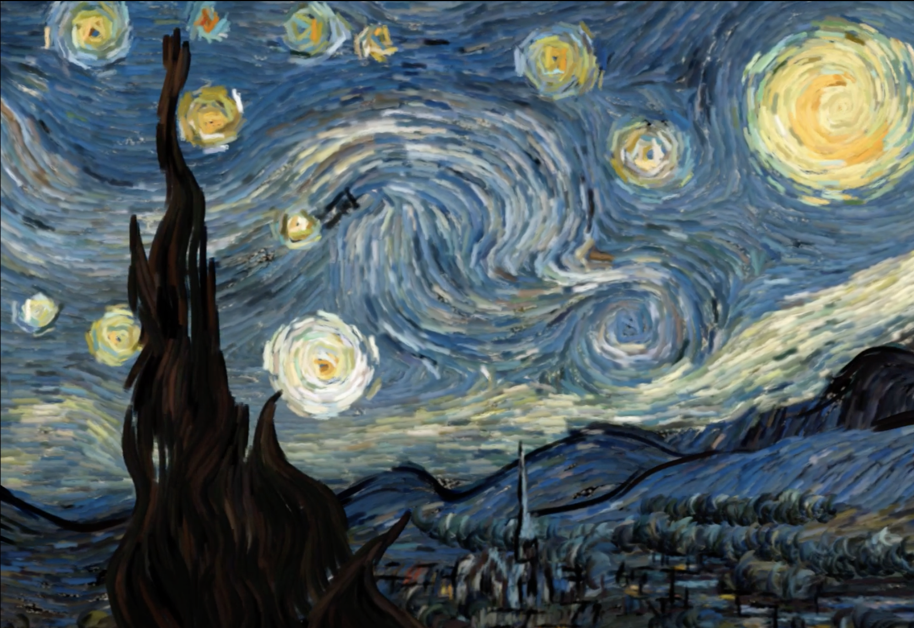
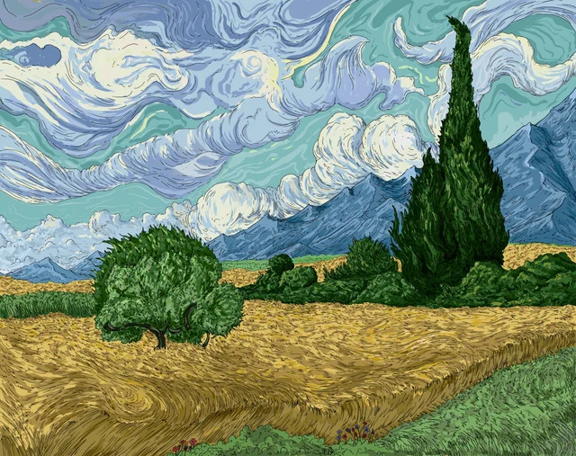

# Brushstroke Animation: Gallery and Usage

## Gallery

This project explores the animation of brushstrokes in paintings, revealing the inherent movement and energy captured within the artist's technique. By analyzing directional patterns in the artwork, our algorithm creates subtle, flowing animations that respect the original composition while adding a new dimension of visual experience.

Each painting responds differently to the animation process, with the resulting movement directly reflecting the artist's brushwork patterns.

### Examples

**Vincent van Gogh's Starry Night**
 → 

The swirling brushwork in this iconic painting creates natural flow patterns that our algorithm effectively captures, enhancing the original sense of movement.

**Wheatfield with Cypresses**
 → 

The vertical cypress trees and flowing wheat fields create contrasting directional movements, demonstrating how the algorithm handles varied brushwork in a single composition.

**Technical Process Visualization**


The combined stroke mask visualizes all detected brushstrokes across different orientations.

## Usage Guide

### Setup

1. Ensure your project has this directory structure:
```
Final Project/
├── debug/         # Debug visualizations 
├── input/         # Place your images here
├── output/        # Generated animations saved here
└── script/        # Python script location
```

2. Install required dependencies:
```bash
pip install numpy opencv-python imageio scikit-image
```

### Running the Tool

1. Place your images in the `input/` directory (supports JPG, PNG)
2. Run the script:
```bash
python script/brushstroke_animation.py
```
3. Find the animated GIFs in the `output/` directory
4. Debug visualizations will be saved to the `debug/` directory

### Understanding Debug Files

- **mask_theta_X.XX.png**: Brushstroke masks at specific orientations
- **flow_direction_theta_X.XX.png**: Visualization of movement directions
- **frame_XXX.png**: Individual animation frames
- **combined_stroke_mask.png**: Combined mask of all brushstrokes

### Configuration

Key parameters to adjust in the script:

| Parameter | Description | Default |
|-----------|-------------|---------|
| `N_FRAMES` | Number of frames in animation | 30 |
| `ANIMATE_FREQUENCY` | Gabor filter frequency | 0.15 |
| `GABOR_THRESHOLD` | Threshold for stroke detection | 0.22 |
| `MAX_DISPLACEMENT` | Maximum pixel movement | 15.0 |
